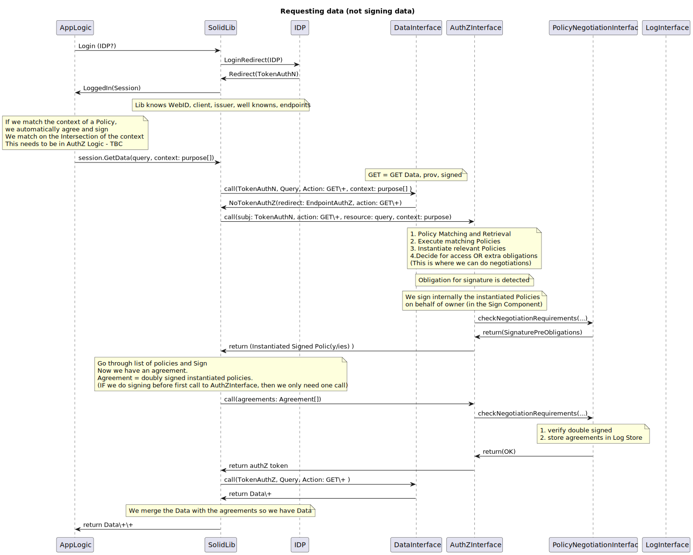

# Vienna-2023

## UML sequence diagrams

Can be online visualised via [sequencediagram.org](https://sequencediagram.org/) or with the vscode extension [PlantUML](https://plantuml.com/).

### Owner set up a policy


### Shop gets data (data not signed)



## Code
How to run:

```sh
npm i
```
Create a .env resource with WebID, user email and password with a CSS (supporting client credentials):

```env
WEB_ID=""
USER_NAME=""
PASSWORD=""
```

Start the Interfaces (AuthZ Interface (server), Admin Interface (server))

```sh
npx ts-node runInterfaces.ts
```

SolidLib shop adds policy flow (needs both admin and auth interfaces running)
```sh
npx ts-node adminFlow.ts
```

SolidLib shop gets data flow

```sh
npx ts-node app.ts 
```

